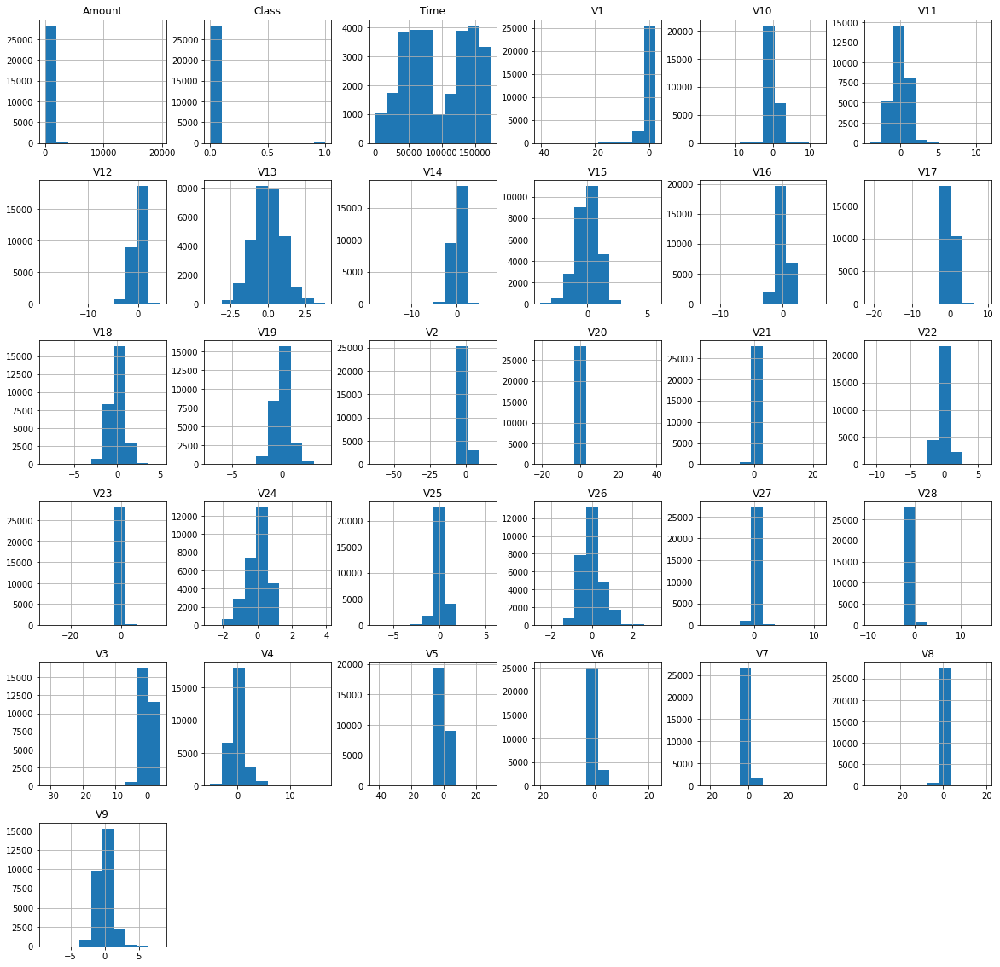
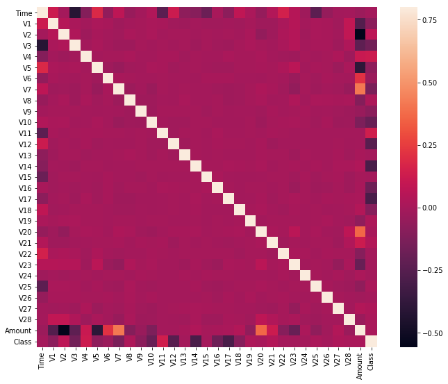

# Credit Card Fraud Detection

Throughout the financial sector, machine learning algorithms are being developed to detect fraudulent transactions.  In this project, that is exactly what we are going to be doing as well.  Using a dataset of of nearly 28,500 credit card transactions and multiple unsupervised anomaly detection algorithms, we are going to identify transactions with a high probability of being credit card fraud.  In this project, we will build and deploy the following two machine learning algorithms:

* Local Outlier Factor (LOF)
* Isolation Forest Algorithm

Furthermore, using metrics suchs as precision, recall, and F1-scores, we will investigate why the classification accuracy for these algorithms can be misleading.

In addition, we will explore the use of data visualization techniques common in data science, such as parameter histograms and correlation matrices, to gain a better understanding of the underlying distribution of data in our data set. Let's get started!

## 1. Importing Necessary Libraries

To start, let's print out the version numbers of all the libraries we will be using in this project. This serves two purposes - it ensures we have installed the libraries correctly and ensures that this tutorial will be reproducible. 


```python
import sys
import numpy
import pandas
import matplotlib
import seaborn
import scipy

print('Python: {}'.format(sys.version))
print('Numpy: {}'.format(numpy.__version__))
print('Pandas: {}'.format(pandas.__version__))
print('Matplotlib: {}'.format(matplotlib.__version__))
print('Seaborn: {}'.format(seaborn.__version__))
print('Scipy: {}'.format(scipy.__version__))

```

    Python: 2.7.13 |Continuum Analytics, Inc.| (default, May 11 2017, 13:17:26) [MSC v.1500 64 bit (AMD64)]
    Numpy: 1.14.0
    Pandas: 0.21.0
    Matplotlib: 2.1.0
    Seaborn: 0.8.1
    Scipy: 1.0.0
    


```python
# import the necessary packages
import numpy as np
import pandas as pd
import matplotlib.pyplot as plt
import seaborn as sns
```

### 2. The Data Set

In the following cells, we will import our dataset from a .csv file as a Pandas DataFrame.  Furthermore, we will begin exploring the dataset to gain an understanding of the type, quantity, and distribution of data in our dataset.  For this purpose, we will use Pandas' built-in describe feature, as well as parameter histograms and a correlation matrix. 


```python
# Load the dataset from the csv file using pandas
data = pd.read_csv('creditcard.csv')
```


```python
# Start exploring the dataset
print(data.columns)
```

    Index([u'Time', u'V1', u'V2', u'V3', u'V4', u'V5', u'V6', u'V7', u'V8', u'V9',
           u'V10', u'V11', u'V12', u'V13', u'V14', u'V15', u'V16', u'V17', u'V18',
           u'V19', u'V20', u'V21', u'V22', u'V23', u'V24', u'V25', u'V26', u'V27',
           u'V28', u'Amount', u'Class'],
          dtype='object')
    


```python
# Print the shape of the data
data = data.sample(frac=0.1, random_state = 1)
print(data.shape)
print(data.describe())

# V1 - V28 are the results of a PCA Dimensionality reduction to protect user identities and sensitive features
```

    (28481, 31)
                    Time            V1            V2            V3            V4  \
    count   28481.000000  28481.000000  28481.000000  28481.000000  28481.000000   
    mean    94705.035216     -0.001143     -0.018290      0.000795      0.000350   
    std     47584.727034      1.994661      1.709050      1.522313      1.420003   
    min         0.000000    -40.470142    -63.344698    -31.813586     -5.266509   
    25%     53924.000000     -0.908809     -0.610322     -0.892884     -0.847370   
    50%     84551.000000      0.031139      0.051775      0.178943     -0.017692   
    75%    139392.000000      1.320048      0.792685      1.035197      0.737312   
    max    172784.000000      2.411499     17.418649      4.069865     16.715537   
    
                     V5            V6            V7            V8            V9  \
    count  28481.000000  28481.000000  28481.000000  28481.000000  28481.000000   
    mean      -0.015666      0.003634     -0.008523     -0.003040      0.014536   
    std        1.395552      1.334985      1.237249      1.204102      1.098006   
    min      -42.147898    -19.996349    -22.291962    -33.785407     -8.739670   
    25%       -0.703986     -0.765807     -0.562033     -0.208445     -0.632488   
    50%       -0.068037     -0.269071      0.028378      0.024696     -0.037100   
    75%        0.603574      0.398839      0.559428      0.326057      0.621093   
    max       28.762671     22.529298     36.677268     19.587773      8.141560   
    
               ...                V21           V22           V23           V24  \
    count      ...       28481.000000  28481.000000  28481.000000  28481.000000   
    mean       ...           0.004740      0.006719     -0.000494     -0.002626   
    std        ...           0.744743      0.728209      0.645945      0.603968   
    min        ...         -16.640785    -10.933144    -30.269720     -2.752263   
    25%        ...          -0.224842     -0.535877     -0.163047     -0.360582   
    50%        ...          -0.029075      0.014337     -0.012678      0.038383   
    75%        ...           0.189068      0.533936      0.148065      0.434851   
    max        ...          22.588989      6.090514     15.626067      3.944520   
    
                    V25           V26           V27           V28        Amount  \
    count  28481.000000  28481.000000  28481.000000  28481.000000  28481.000000   
    mean      -0.000917      0.004762     -0.001689     -0.004154     89.957884   
    std        0.520679      0.488171      0.418304      0.321646    270.894630   
    min       -7.025783     -2.534330     -8.260909     -9.617915      0.000000   
    25%       -0.319611     -0.328476     -0.071712     -0.053379      5.980000   
    50%        0.015231     -0.049750      0.000914      0.010753     22.350000   
    75%        0.351466      0.253580      0.090329      0.076267     78.930000   
    max        5.541598      3.118588     11.135740     15.373170  19656.530000   
    
                  Class  
    count  28481.000000  
    mean       0.001720  
    std        0.041443  
    min        0.000000  
    25%        0.000000  
    50%        0.000000  
    75%        0.000000  
    max        1.000000  
    
    [8 rows x 31 columns]
    


```python
# Plot histograms of each parameter 
data.hist(figsize = (20, 20))
plt.show()
```





```python
# Determine number of fraud cases in dataset

Fraud = data[data['Class'] == 1]
Valid = data[data['Class'] == 0]

outlier_fraction = len(Fraud)/float(len(Valid))
print(outlier_fraction)

print('Fraud Cases: {}'.format(len(data[data['Class'] == 1])))
print('Valid Transactions: {}'.format(len(data[data['Class'] == 0])))


```

    0.00172341024198
    Fraud Cases: 49
    Valid Transactions: 28432
    


```python
# Correlation matrix
corrmat = data.corr()
fig = plt.figure(figsize = (12, 9))

sns.heatmap(corrmat, vmax = .8, square = True)
plt.show()
```





```python
# Get all the columns from the dataFrame
columns = data.columns.tolist()

# Filter the columns to remove data we do not want
columns = [c for c in columns if c not in ["Class"]]

# Store the variable we'll be predicting on
target = "Class"

X = data[columns]
Y = data[target]

# Print shapes
print(X.shape)
print(Y.shape)
```

    (28481, 30)
    (28481L,)
    

## 3. Unsupervised Outlier Detection

Now that we have processed our data, we can begin deploying our machine learning algorithms.  We will use the following techniques: 

**Local Outlier Factor (LOF)**

The anomaly score of each sample is called Local Outlier Factor. It measures the local deviation of density of a 
given sample with respect to its neighbors. It is local in that the anomaly score depends on how isolated the 
object is with respect to the surrounding neighborhood.


**Isolation Forest Algorithm**

The IsolationForest ‘isolates’ observations by randomly selecting a feature and then randomly selecting 
a split value between the maximum and minimum values of the selected feature.

Since recursive partitioning can be represented by a tree structure, the number of splittings required to 
isolate a sample is equivalent to the path length from the root node to the terminating node.

This path length, averaged over a forest of such random trees, is a measure of normality and our decision function.

Random partitioning produces noticeably shorter paths for anomalies. Hence, when a forest of random trees 
collectively produce shorter path lengths for particular samples, they are highly likely to be anomalies.


```python
from sklearn.metrics import classification_report, accuracy_score
from sklearn.ensemble import IsolationForest
from sklearn.neighbors import LocalOutlierFactor

# define random states
state = 1

# define outlier detection tools to be compared
classifiers = {
    "Isolation Forest": IsolationForest(max_samples=len(X),
                                        contamination=outlier_fraction,
                                        random_state=state),
    "Local Outlier Factor": LocalOutlierFactor(
        n_neighbors=20,
        contamination=outlier_fraction)}
```


```python
# Fit the model
plt.figure(figsize=(9, 7))
n_outliers = len(Fraud)


for i, (clf_name, clf) in enumerate(classifiers.items()):
    
    # fit the data and tag outliers
    if clf_name == "Local Outlier Factor":
        y_pred = clf.fit_predict(X)
        scores_pred = clf.negative_outlier_factor_
    else:
        clf.fit(X)
        scores_pred = clf.decision_function(X)
        y_pred = clf.predict(X)
    
    # Reshape the prediction values to 0 for valid, 1 for fraud. 
    y_pred[y_pred == 1] = 0
    y_pred[y_pred == -1] = 1
    
    n_errors = (y_pred != Y).sum()
    
    # Run classification metrics
    print('{}: {}'.format(clf_name, n_errors))
    print(accuracy_score(Y, y_pred))
    print(classification_report(Y, y_pred))

```

    Local Outlier Factor: 97
    0.9965942207085425
                 precision    recall  f1-score   support
    
              0       1.00      1.00      1.00     28432
              1       0.02      0.02      0.02        49
    
    avg / total       1.00      1.00      1.00     28481
    
    Isolation Forest: 71
    0.99750711000316
                 precision    recall  f1-score   support
    
              0       1.00      1.00      1.00     28432
              1       0.28      0.29      0.28        49
    
    avg / total       1.00      1.00      1.00     28481
    
    
